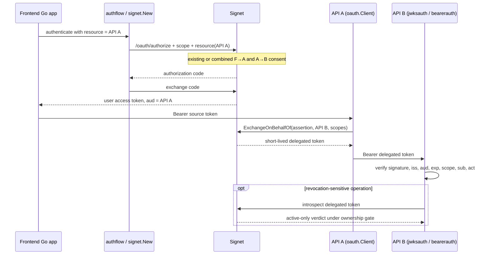

# Plan: Signet Standard OBO support for sdk-go

## Goal

Go backend services need first-class support for Signet's opt-in, single-hop
On-Behalf-Of flow added by
[signet#66](https://github.com/go-signet/signet/pull/66) and complemented by
[signet#81](https://github.com/go-signet/signet/pull/81). Done means a frontend
can obtain a Signet user access token bound to API A (including the combined
consent configured by an administrator), API A can exchange that token for a
short-lived token bound to API B, and API B can validate the user, audience,
scope, and issuer-controlled `act` claim without hand-building protocol forms
or decoding unverified JWTs. The SDK adopts resource-aware grant signatures
without preserving source compatibility, adds no new third-party dependency,
and does not expose Signet's administrator OBO registry as a client-side API.

## Upstream contract and findings

- `POST /oauth/token` performs OBO with these form fields:
  - `grant_type=urn:ietf:params:oauth:grant-type:jwt-bearer`
  - `requested_token_use=on_behalf_of`
  - `assertion=<Signet user access token for API A>`
  - exactly one `resource=<API B URI>`
  - `scope=<space-delimited downstream scopes>`
- API A must authenticate as an active confidential client. Signet accepts
  HTTP Basic or form-body client credentials; the existing SDK consistently
  uses form-body credentials through `setClientAuth`.
- A successful exchange returns the existing OAuth `Token` shape and never a
  refresh token or ID token. Its lifetime is bounded by the source token, the
  actor client profile, and five minutes.
- The delegated JWT preserves the user in `sub`, identifies API A in
  `client_id`, targets only API B in `aud`, and carries
  `act: {"sub":"client:<API A client ID>"}`.
- `act` and `may_act` became issuer-reserved claims for every grant. They must
  not be surfaced as caller-controlled `Claims.Extras`.
- OBO is advertised by discovery only when enabled through
  `grant_types_supported`; the existing `discovery.Metadata` already exposes
  that list and needs no new field.
- PR #81 makes policy/resource/scope/bundle management a Signet administrator
  concern. It adds no client wire protocol. Its SDK impact is that the initial
  authorization request must be able to carry the RFC 8707 `resource` for API A
  so Signet can select the combined consent bundle.
- With Signet's default introspection ownership gate, API B receives only
  `{"active":true}` for an API-A-owned delegated token. Therefore API B must
  validate the JWT locally (signature, issuer, audience, expiry, scope, `type`,
  user, and actor) and may use introspection only as a separate live
  revocation/lineage check. A bare active verdict is not identity metadata.

## Change classification: CORE CODE

- Q1 (propagation): exported OAuth/authentication APIs are consumed by many
  applications → core.
- Q2 (frequency): OBO and resource-indicator APIs will be extended as the
  protocol evolves → core.
- Q3 (tech debt): ambiguous request or claim types would be copied into every
  integrating service → core.
- Q4 (examples): this changes a public SDK API and authorization boundary →
  core.
- Q5 (failure cost): a wrong audience, actor, or source-token binding can
  authorize calls to the wrong service → core.
- Q6 (review intensity): tests are necessary but security-sensitive claim and
  request construction require line-by-line review → core.

Recommended review: a human leads the public API design; require at least two
reviewers, including the SDK/auth owner, and record which changed files were
reviewed line by line. Keep the two implementation slices below in separate
commits or PRs if either grows beyond its stated scope.

## Architecture / flow



New public entry points are `authflow.WithResources`, `signet.WithResources`,
`clientcreds.WithResources`, `oauth.Client.ExchangeOnBehalfOf`, resource-aware
OAuth grant methods, and typed actor/audience results. The Signet server and
existing discovery/JWKS machinery are existing components.

## Proposed public API

The exact identifiers are part of the core-code review, but implementation
should start from this small, typed surface:

```go
// oauth
const GrantTypeJWTBearer = "urn:ietf:params:oauth:grant-type:jwt-bearer"
const RequestedTokenUseOnBehalfOf = "on_behalf_of"

type OnBehalfOfRequest struct {
    Assertion string
    Resource  string
    Scopes    []string
}

func (c *Client) ExchangeOnBehalfOf(
    ctx context.Context,
    req OnBehalfOfRequest,
) (*Token, error)
```

`ExchangeOnBehalfOf` must use the existing `tokenRequest` and `setClientAuth`
path, require nonblank assertion/resource and at least one nonblank scope before
network I/O, normalize scopes exactly once with space separation, and leave URI,
policy, consent, token lineage, and credential authorization to Signet. It must
not log or wrap the source assertion/client secret into returned errors.

Add the server error constants needed for programmatic OBO handling if absent:
`ErrCodeInvalidClient`, `ErrCodeUnauthorizedClient`, `ErrCodeInvalidScope`,
`ErrCodeInvalidTarget`, and `ErrCodeUnsupportedGrantType`. Existing `*oauth.Error`
parsing remains the typed error mechanism.

```go
// authflow; shared by authorization-code and device-code flows
func WithResources(resources ...string) FlowOption

// root facade; forwarded to interactive authentication and token refresh
func WithResources(resources ...string) signet.Option
```

Support repeatable, canonical nonblank resources across authorization code,
device code, refresh, and client credentials. Reject blank values with an SDK
`invalid_request` error before network I/O. Existing behavior is preserved when
resources are omitted. Per the approved scope revision, the OAuth grant method
signatures may change to take a resource slice; Standard OBO exchange itself
continues to accept exactly one target resource.

For verified results, add a small actor value (`Subject string`) and parse the
polymorphic `aud` claim into a canonical string slice:

- `oauth.IntrospectionResult`: expose `Audience []string` and optional actor.
- `oauth.TokenInfo`: expose `Audience []string`; upstream tokeninfo currently
  does not emit `act`, so do not fabricate one.
- `jwksauth.Claims`: expose optional, strictly decoded `Actor`; reserve both
  `act` and `may_act` from `Extras`. Reject a present `act` whose value is not an
  object with exactly one nonblank `sub`, rather than treating malformed
  issuer-controlled authorization data as an ordinary token.
- `bearerauth.Identity`: copy the verified actor subject from the JWT path so
  framework-independent users can audit/distinguish delegation. Personal API
  Keys have no actor.

Prefer separate package-local actor types over making `jwksauth` depend on the
HTTP `oauth` package. A convenience `ActorClientID() (string, bool)` may be
added only if tests establish strict handling of the `client:` prefix; the raw
verified actor subject remains the source of truth.

## Implementation slices

### Slice 1 — RFC 8707 resources and combined consent

- Add shared interactive-flow, root-facade, and client-credentials options for
  repeatable RFC 8707 resources.
- Put `resource` on authorization/device initiation and on every token grant
  request so callers can request or narrow audiences consistently.
- Isolate cached root-facade tokens by resource set so a client ID cannot reuse
  a token issued for a different audience.
- Document that administrator-created PR #81 bundles are selected server-side;
  the SDK neither creates policies nor grants consent silently.

### Slice 2 — exchange and delegated-token consumption

- Add the OBO request/method/constants and typed OBO error constants.
- Add audience/actor decoding for online response types.
- Add strict verified `act` handling in `jwksauth` and propagate it through
  `bearerauth.Identity`.
- Document offline validation plus optional uncached introspection. Do not add
  token caching, automatic downstream HTTP forwarding, refresh OBO, Agent OBO,
  multi-hop delegation, Microsoft Entra compatibility, or a general RFC 8693
  token-exchange abstraction.

## Scope

### May modify

- `oauth/oauth.go`
- `oauth/oauth_test.go`
- `oauth/example_test.go`
- `oauth/README.md`
- `authflow/authflow.go`
- `authflow/authflow_test.go`
- `authflow/example_test.go`
- `authflow/README.md`
- `clientcreds/clientcreds.go`
- `clientcreds/clientcreds_test.go`
- `clientcreds/README.md`
- `signet.go`
- `example_test.go`
- `README.md`
- `jwksauth/claims.go`
- `jwksauth/claims_prefix_test.go` or a focused new `jwksauth/*_test.go`
- `jwksauth/example_test.go`
- `jwksauth/README.md`
- `bearerauth/identity.go`
- `bearerauth/jwt.go`
- focused existing/new `bearerauth/*_test.go`
- `bearerauth/example_test.go`
- `bearerauth/README.md`

### Must not modify

- `credstore/` — delegated tokens are short-lived request credentials, not a
  new refreshable login session.
- `middleware/` — its online-only abstraction cannot safely manufacture actor
  metadata from Signet's ownership-stripped introspection verdict; recommend
  `jwksauth`/`bearerauth` for OBO resource validation.
- `discovery/` — its existing `GrantTypesSupported` and `Endpoints` are enough.
- Signet server administration/configuration APIs — PR #81 is operator-side.
- Credential-store formats; resource-scoped cache keys may be additive.
- `go.mod` / `go.sum`, unless implementation proves an unavoidable need and a
  human explicitly approves it; the planned design needs no dependency.

## Existing patterns to follow

- Mirror `oauth.ClientCredentials` and `tokenRequest` for form construction,
  endpoint validation, response limits, client authentication, retries, body
  replay, redirect refusal, and OAuth-shaped errors.
- Mirror `authflow.WithLocalPort` and root `signet.WithScopes` when adding
  functional options; clone caller slices so later mutation cannot change a
  running flow.
- Mirror `jwksauth.newTokenInfo` for verified-claim extraction and the package's
  fail-closed errors. Actor values must come from `IDToken.Claims` only after
  signature/issuer/audience/time validation.
- Mirror `bearerauth.identityFromJWT` for normalization; never copy raw tokens
  or arbitrary claim maps into `Identity`.
- Keep package examples compile-tested and update the README next to every
  affected public package.

## Constraints

- Support Go 1.26 and 1.27 as required by CI.
- Preserve zero-resource behavior for existing callers; OAuth grant method
  signatures intentionally change to accept resources per user direction.
- No new third-party dependency and no new background goroutine/cache.
- Never include assertion/token/client-secret values in logs or errors.
- Exactly one OBO hop, one OBO target resource, Signet-issued user access-token
  assertion, and no refresh/ID token in the successful OBO result.
- Treat `act`/`may_act` as issuer-controlled reserved authorization claims.
- Do not infer OBO enablement from a stale discovery cache as an authorization
  decision. Discovery can improve UX; the token endpoint remains authoritative.

## Verification

### Three end-to-end contract tests (using `httptest.Server`)

1. Happy path: an auth-code flow configured with API A sends exactly one
   `resource` on `/oauth/authorize`; API A then calls `ExchangeOnBehalfOf`, and
   the captured token form contains each required field exactly once plus the
   configured confidential-client credentials. The returned access token,
   scopes, and expiry parse through the existing `Token` type.
2. Policy/input failure: malformed local requests perform no HTTP call, while
   Signet `invalid_grant`, `invalid_scope`, `invalid_target`,
   `unauthorized_client`, and `invalid_client` responses remain inspectable via
   `errors.As(err, *oauth.Error)` with their HTTP status and without credential
   material in the error string.
3. Resource-server boundary: a signed delegated test JWT for API B yields the
   original user subject and actor A after `jwksauth`/`bearerauth` validation;
   wrong audience and malformed/multi-hop actor shapes fail closed, and `act`
   or `may_act` never appears in `Extras`.

### Focused tests

- Omitted resource keeps current authorization URLs byte-for-byte compatible.
- Caller mutation of the resources/scopes slices cannot alter a request.
- Scope whitespace/empty entries are handled deterministically; an empty
  effective scope is rejected before network I/O.
- `aud` decodes from both JSON string and string-array forms; wrong JSON types
  fail decoding rather than silently yielding no audience.
- Ordinary nondelegated JWTs remain valid with a nil actor.
- Personal API Key identities remain unchanged and actor-free.
- Discovery with and without the OBO grant remains readable through the
  existing `GrantTypesSupported` field.
- Run `go test -race ./oauth ./authflow ./jwksauth ./bearerauth ./...`.
- Run `make fmt`, `make lint`, `make test`, `go mod tidy`, and require no
  `go.mod`/`go.sum` diff.

### Manual integration

Against an isolated Signet deployment with OBO database policy and combined
consent enabled:

1. Configure F→A and A→B as in PR #81, use the SDK auth-code flow, and verify a
   single browser consent creates the two independent grants while returning
   only F's authorization code.
2. Exchange F's API-A-audience token through API A; confirm API B accepts the
   result only for its own audience/scope, sees user F's subject plus actor A,
   and rejects the original API-A token.
3. Disable/revoke the policy or source grant, confirm uncached introspection
   returns inactive for the delegated token, and confirm no refresh token or ID
   token was persisted or returned.

No dedicated soak test is required: the SDK adds stateless request building
and claim decoding, while server concurrency/policy invalidation was covered by
the upstream PRs. The race-enabled suite is the concurrency gate.

## Done definition

- [ ] Both slices preserve zero-resource behavior and update every in-repository
      caller for the intentionally changed OAuth grant signatures.
- [ ] A Go application can request an API-A-bound source token without manually
      constructing the authorization URL.
- [ ] API A can perform OBO with one typed SDK call and handle typed OAuth
      errors.
- [ ] API B can read only verified audience/user/actor data and malformed actor
      claims fail closed.
- [ ] `act` and `may_act` cannot surface as caller-controlled extras.
- [ ] Existing non-OBO, Personal API Key, device, refresh, and client-credential
      behavior is unchanged.
- [ ] The automated and manual verification above passes on Go 1.26 and 1.27.
- [ ] No dependency or credential-store format change is present.
- [ ] PR description identifies AI assistance and two human reviewers complete
      core-code/security review.
- [ ] No implementation changes fall outside the "May modify" list without a
      reviewed plan amendment.

## Risks and rollback

- Risk: changing OAuth grant method signatures requires downstream source
  updates. Mitigation: make the change consistently across every grant and
  document the new resource argument in one release note.
- Risk: treating malformed `act` as absent could turn a delegated credential
  into an ordinary user token. Mitigation: strict fail-closed decoding when the
  claim is present.
- Risk: treating `{"active":true}` introspection as complete identity metadata
  could bypass audience/actor/scope checks. Mitigation: local verified JWT
  claims are authoritative for identity; introspection is liveness-only under
  the ownership gate.
- Risk: persisting delegated tokens could outlive source authorization intent.
  Mitigation: this plan does not add storage/refresh behavior for them.
- Rollback: revert Slice 2 to remove the new exchange/claim surface, then Slice
  1 to remove the resource forwarding. No storage/schema migration is needed;
  callers must compile against the selected SDK version's grant signatures.

## Open questions for plan approval

- Confirm the recommended strict rule: a present `act` supports only the
  upstream single-hop shape `{ "sub": "client:<id>" }`; nested actors or extra
  members are rejected rather than ignored.
- Resolved during implementation: resource indicators cover authorization
  code, device code, refresh, and client credentials, and source compatibility
  of the grant-method signatures is not required.
